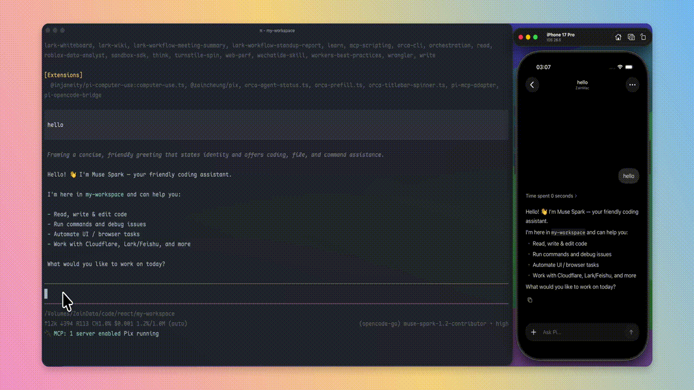

# Pix

Use Pi from your phone, wherever you are.

Pix connects your iPhone to the Pi coding agent running on your Mac or Linux machine, so you can start, resume, and control local sessions remotely.

<p align="center">
  
</p>


[](https://www.youtube.com/watch?v=OLZ0yUpsOD0)

<p align="center">
  <a href="https://pix.deepoke.com">Website</a> ·
  <a href="docs/(start)/INSTALLATION.md">Installation</a> ·
  <a href="docs/(use-pix)/TROUBLESHOOTING.md">Troubleshooting</a> ·
  <a href="https://github.com/ZainCheung/pix/releases">Releases</a>
</p>

## Install

Pix requires [Pi](https://github.com/badlogic/pi-mono) to be installed and working on your computer.

On macOS or Linux:

```sh
curl -fsSL https://pix.deepoke.com/install.sh | sh
pix setup
```

For Homebrew, Linux packages, manual downloads, source builds, and uninstall instructions, see [Installation](<docs/(start)/INSTALLATION.md>).

Remote control client:

For iPhone, install [Pix for iPhone](https://testflight.apple.com/join/crTbabdp) via TestFlight.

## Get started

1. Run `pix setup` on your computer.
2. Pair your iPhone with the host.
3. Choose a workspace and open an existing Pi session or start a new one.

That's it.

Pix keeps Pi running on your computer while your phone acts as the remote interface.

## Highlights

* **Native Pi sessions** — continue the sessions already on your computer.
* **Remote access** — connect over your local network or through an encrypted relay.
* **Local-first** — projects, credentials, and Pi processes stay on your machine.
* **Workspace control** — expose only the folders you choose.
* **Device pairing** — authorize and revoke clients individually.
* **macOS & Linux** — Apple Silicon macOS and Linux hosts are supported.

## How it works

```text
iPhone  ←→  Pix  ←→  Pi on your computer
```

When your devices are on the same network, Pix connects directly.

When you're away, Pix can use an encrypted relay without exposing your computer directly to the internet.

Pix is not another coding agent. Pi remains the agent that reads your workspace, runs tools, and owns your sessions.

## Remote access

Pix supports both local and remote connections.

For relay setup, pairing, networking details, or deploying your own relay to Cloudflare, see:

[Remote access →](<docs/(use-pix)/REMOTE_ACCESS.md>)

## Privacy

Your repositories, credentials, and Pi sessions stay on your computer.

Pix has no account system, and clients must be explicitly paired with a host before they can connect.

For the full security model, see [SECURITY.md](SECURITY.md).

## Documentation

* [Installation](<docs/(start)/INSTALLATION.md>) — install, update, and uninstall Pix
* [Remote access](<docs/(use-pix)/REMOTE_ACCESS.md>) — LAN, relay, pairing, and self-hosting
* [CLI reference](<docs/(reference)/CLI.md>) — Pix commands and service control
* [Optional Pi TUI bridge](<docs/(use-pix)/PI_TUI_BRIDGE.md>) — `pi install npm:@zaincheung/pix`
* [Troubleshooting](<docs/(use-pix)/TROUBLESHOOTING.md>) — common setup and connection issues
* [Architecture](<docs/(develop-pix)/ARCHITECTURE.md>) — host, protocol, and security design
* [Development](<docs/(develop-pix)/DEVELOPMENT.md>) — build and contribute to Pix

## Contributing

Contributions are welcome.

See [CONTRIBUTING.md](CONTRIBUTING.md) for the development workflow and contribution guidelines.

## License

Pix Host is licensed under the [GNU General Public License v3.0](LICENSE).
