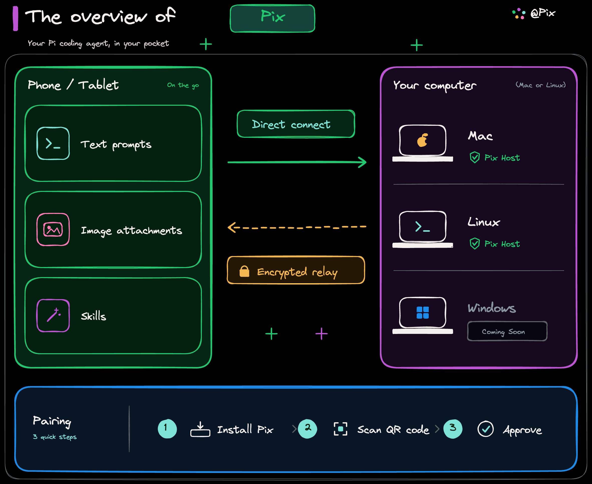

<h1 align="center">Pix</h1>

<p align="center">
  Use your local Pi coding agent from anywhere.
</p>

<p align="center">
  Continue Pi sessions from your phone while your projects, credentials,
  and agent processes stay on your own computer.
</p>

<p align="center">
  <a href="#installation">Install</a> ·
  <a href="#quick-start">Quick start</a> ·
  <a href="#documentation">Documentation</a> ·
  <a href="https://pix.deepoke.com">Website</a>
</p>

<p align="center">
  <a href="https://github.com/ZainCheung/pix/actions/workflows/ci.yml"></a>
  <a href="https://github.com/ZainCheung/pix/releases"></a>
  <a href="LICENSE"></a>
</p>

<p align="center">
  
</p>

## What is Pix?

Pix connects your phone or another Pix client to the Pi coding agent running
on your Mac or Linux computer. Pix is the remote interface, not a second
coding agent: Pi stays the process that reads your workspace and runs your
prompts.

Devices on the same network connect directly. When they are apart, Pix routes
through an encrypted relay. Start a session at your desk, leave the computer
running, and continue it from your phone.

| Component | Runs where | Purpose |
| --- | --- | --- |
| Pi | Your computer | Runs the coding agent and owns the native sessions. |
| Pix Host | Your computer | Connects authorized clients to Pi and your workspaces. |
| Pix Client | Phone | Chooses a workspace and controls Pi. |
| Pix Relay | Internet | Connects client and host when direct LAN access is unavailable. |

## Features

- Use Pi from your phone without staying at your desk.
- Continue the Pi sessions that already live on your computer.
- Authorize only the workspace folders you choose.
- Pair devices one by one and revoke any of them later.
- Connect directly on the local network, or through an encrypted relay when away.

## Requirements

- macOS 14 or newer, or Linux on x86_64 or ARM64.
- Pi installed and working locally. Pix checks the supported Pi version during setup.
- Access to a Pix client. The native iOS client is in private beta and is not distributed from this repository.

## Installation

The first-party installer covers Apple Silicon macOS and Linux. It installs
`pix` into `~/.local/bin` and, on macOS, `Pix.app` into `~/Applications`,
and needs no root:

```sh
curl -fsSL https://pix.deepoke.com/install.sh | sh
```

For Homebrew, Debian/RPM packages, manual archives, and source builds, see
[Installation](docs/INSTALLATION.md).

## Quick start

### 1. Make sure Pi works

On the computer that will host Pix:

```sh
pi --version
pi
```

### 2. Install Pix

Use the installer above, or download a release archive from the
[website](https://pix.deepoke.com). Then check that `pix` is on your `PATH`:

```sh
pix --version
```

### 3. Install the Pi bridge

Install the optional bridge through Pi's package manager:

```sh
pi install npm:@zaincheung/pix
```

If Pi is already running, use `/reload` or restart Pi after installation.

### 4. Run setup

```sh
pix setup
```

The wizard walks you through choosing a workspace, network access, pairing,
and the background service. Pick the relay option if your phone will connect
from outside the local network.

To prepare a host without prompts:

```sh
pix setup --workspace "$HOME/Projects/my-project" \
  --no-pair --no-service --non-interactive
```

### 5. Pair your phone

The iOS client is in private beta; you need access to it to pair. On either
path, compare the six-digit code shown on both devices and approve the
request on the computer.

- **Local network:** open Pix on your iPhone and choose your computer from
  nearby hosts. Both devices must be on the same network.
- **Relay:** `pix setup` prints a one-time QR code. Scan it from Pix on your
  iPhone. The pairing offer expires after two minutes.

If you use the macOS menu-bar app, choose **Add Device…** from its menu-bar
icon for the same pairing guide.

### 6. Open a workspace

Pix shows the workspace roots you authorized on the host. Select one to see
its Pi sessions.

### 7. Start or resume Pi

Create a session or open an existing one, then send your first prompt. If the
phone disconnects, the local Pi process keeps running.

## Remote access

Nearby devices connect directly over the LAN. Across networks, the host dials
out through Pix Relay:

```text
Pix Client ── encrypted ── Pix Relay ── encrypted ── Pix Host
```

The host opens the connection, so no ports are exposed to the internet. For
LAN discovery, relay pairing, and self-hosting details, see
[Remote access](docs/REMOTE_ACCESS.md).

### Deploy your own relay to Cloudflare

<p align="center">
  <a href="https://deploy.workers.cloudflare.com/?url=https://github.com/ZainCheung/pix/tree/main/relay"></a>
</p>

The button deploys the `relay/` Worker and its Durable Object to your own
Cloudflare account, not Pix's. Cloudflare asks you to authorize GitHub and
Cloudflare access first. Once it gives you a Worker hostname, point Pix at it:

```sh
pix relay set wss://your-worker.your-subdomain.workers.dev
pix relay show
```

Then run `pix device pair` to start remote pairing.

## Security & privacy

- Repositories, credentials, and Pi sessions stay on your computer. Pix
  creates no hosted copy of your conversations.
- Pix exposes only the workspace roots you explicitly authorize.
- A client must be paired before it can connect, and paired devices can be
  revoked at any time.
- There are no Pix accounts; authorization happens on the host.
- Connections are encrypted end to end. The relay forwards ciphertext and
  cannot inspect application payloads.

See [SECURITY.md](SECURITY.md) and the [security model](docs/ARCHITECTURE.md).

## Documentation

Using Pix:

- [Installation](docs/INSTALLATION.md) — packages, archives, uninstall.
- [Remote access](docs/REMOTE_ACCESS.md) — LAN, relay, pairing, Cloudflare deployment.
- [CLI reference](docs/CLI.md) — every command and service control.
- [Troubleshooting](docs/TROUBLESHOOTING.md) — fixes for setup, pairing, and relay problems.

Developing Pix:

- [Architecture](docs/ARCHITECTURE.md) — host modules and security invariants.
- [Protocol schema](protocol/schema/v1.md) — versioned wire contract.
- [Decisions](docs/DECISIONS.md) — durable product and architecture decisions.
- [Development](docs/DEVELOPMENT.md) — build, test, package, and debug.
- [Release](docs/RELEASE.md) — versioning, packaging, and relay deployment workflow.
- [Relay contract](relay/README.md) — Worker behavior and local relay development.
- [Repository boundary](docs/REPOSITORY.md) — public and private components.
- [Contributing](CONTRIBUTING.md) — pull request and protocol-change expectations.
- [Security](SECURITY.md) — vulnerability reporting and scope.

## Development

```sh
git clone https://github.com/ZainCheung/pix.git
cd pix
cargo build --workspace
cargo test --workspace
```

Relay contributors can run `cd relay && npm ci && npm test && npm run typecheck`.
See [Development](docs/DEVELOPMENT.md) for the complete workflow.

## Project status

Pix is under active development. This repository contains the host, CLI,
wire protocol, relay, and macOS menu-bar client.

## License

Copyright (C) 2026 ZainCheung

Pix Host is available under the [GNU General Public License v3.0](LICENSE).
Third-party dependencies retain their own licenses; see
[THIRD_PARTY_NOTICES.md](THIRD_PARTY_NOTICES.md).
